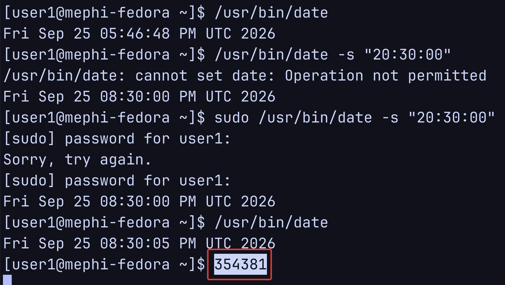

## Раздел 1. Создание пользователя

### 1.1. Создание пользователя

#### Задание

Создайте обычного пользователя user1 с идентификатором 1234.

Пользователь должен входить в группу students.

Настройте необходимость изменения пароля пользователя user1 каждые три месяца.

#### Реализация

Сначала создадим группу students

```bash
sudo groupadd students
```

Убедимся, что группа реально создалась.

```bash
tail /etc/group
```


Рисунок 1 – группа `students` в файле `/etc/group`

Создаем пользователя user1 с домашней директорией и заданным идентификатором.

```bash
sudo useradd -m -u 1234 -g students user1
```


Рисунок 2 – создание пользователя `user1` с UID 1234

Меняем пароль пользователю.

```bash
sudo passwd user1
```


Рисунок 3 – установка пароля для пользователя `user1`

Настроим необходимость изменения пароля пользователя user1 каждые три месяца.

```bash
sudo chage -M 90 user1
```

`chage` — команда для управления сроками действия пароля пользователя.

`-M 90` — установить максимальное количество дней, в течение которых пароль можно использовать без смены.

```bash
sudo chage -l user1
```


Рисунок 4 – срок действия пароля пользователя `user1` – 90 дней

***

## Раздел 2. Мониторинг файлов и процессов (5 баллов)

### 2.1. Мониторинг файлов

#### Задание

Найдите в системе все файлы с установленным битом set-UID.
#### Реализация

```bash
find / -type f -perm -4000 2>/dev/null
```

`-type f` — только обычные файл
`-perm -4000` — файлы с установленным SUID-битом


Рисунок 5 – поиск файлов с установленным битом set-UID

```
/usr/lib/polkit-1/polkit-agent-helper-1
/usr/bin/newgrp
/usr/bin/gpasswd
/usr/bin/umount
/usr/bin/chage
/usr/bin/mount
/usr/bin/pkexec
/usr/bin/su
/usr/bin/passwd
/usr/bin/sudo
/usr/sbin/grub2-set-bootflag
/usr/sbin/pam_timestamp_check
/usr/sbin/unix_chkpwd
/usr/sbin/mount.nfs
```

### 2.2. Мониторинг процессов

#### Задание

Найдите в системе все процессы, у которых эффективный UID равен 0, а реальный UID относится к обычным пользователям.

Если таких процессов в данный момент в системе нет, то на одном терминале начните менять пароль с помощью команды passwd, а на другом терминале осуществите поиск процессов с повышенными привилегиями.

#### Реализация

```bash
ps -eo pid,ruid,euid,user,comm,args | awk '$3 == 0 && $2 >= 1000'
```

`-e` — показать все процессы в системе, а не только процессы текущего пользователя или терминала.

`-o` — задать собственный формат вывода. Здесь после `-o` перечислены нужные столбцы:

- `pid` — идентификатор процесса, PID.
- `ruid` — Real UID, реальный UID пользователя, который запустил процесс.
- `euid` — Effective UID, эффективный UID, то есть UID, права которого процесс использует сейчас.
- `user` — имя пользователя, соответствующее эффективному UID.
- `comm` — имя исполняемой программы, например `passwd`, `bash`, `sshd`.
- `args` — полная командная строка процесса вместе с аргументами.

Таких процессов нет


Рисунок 6 – отсутствие процессов с EUID 0 и RUID обычного пользователя

попробую с `passwd`.


Рисунок 7 – процесс `passwd` с RUID 1000 и EUID 0

получилось.

- `2252` — PID процесса.
- `RUID = 1000` — процесс запущен обычным пользователем `andrey`.
- `EUID = 0` — процесс выполняется с эффективными правами `root`.
- `USER = root` — соответствует эффективному UID 0.
- `passwd` — имя и команда процесса.

***
## Раздел 3. Изучение механизма set-UID

### 3.1. Выбор утилиты
#### Задание

Выберите существующую утилиту (команду BASH).

Придумайте операцию, которая для своего выполнения требует права root.

Например, чтение файла /etc/passwd командой cat.
#### Реализация

Решил взять утилиту `cat`.


Рисунок 8 – ошибка чтения `/etc/shadow` обычной утилитой `cat`

### 3.2. Выполнение привилегированной операции с помощью механизма set-UID
#### Задание

Скопируйте утилиту в директорию пользователя.

С помощью механизма set-UID обеспечьте выполнение утилитой привилегированной операции.

Убедитесь, что операция выполняется успешно.
#### Реализация

1) Из под пользователями с правами суперпользователя копируем утилиту в домашнюю директорию пользователя `user1`.

```bash
sudo cp /usr/bin/cat /home/user1/cat-suid
```


Рисунок 9 – копирование `cat` в домашний каталог пользователя `user1`

Устанавливаем set-UID

```bash
sudo chmod 4755 /home/user1/cat-suid
```

```bash
sudo ls -l /home/user1/cat-suid
```

```bash
sudo stat /home/user1/cat-suid
```


Рисунок 10 – установка бита set-UID для файла `cat-suid`

Теперь за user1 попробуем прочитать `/etc/shadow` через два разных cat


Рисунок 11 – сравнение обычной и set-UID-копии утилиты `cat`

через `/usr/bin/cat` не получается прочитать /etc/shadow
через `cat-suid` получается прочитать /etc/shadow

## Раздел 4. Изучение механизма привилегий

План такой: берём команду `chown`. Обычный пользователь `user1` не может сделать владельцем файла, например, `root`, поэтому сначала мы это проверим и получим ошибку `Operation not permitted`.

Потом копируем `chown` в `/home/user1/chown-cap` и выдаём этой копии capability `CAP_CHOWN`. Она даёт программе одно нужное дополнительное право, менять владельца файла, не выдавая ей все права `root`.

После этого снова заходим под `user1` и повторяем ту же операцию. Обычный `/usr/bin/chown` по-прежнему не сработает, а `/home/user1/chown-cap` с `CAP_CHOWN` сможет поменять владельца файла на `root`.

### 4.1. Выбор утилиты

#### Задание

Выберите существующую утилиту (команду BASH).

Придумайте операцию, которая для своего выполнения требует права root.

Например, изменение владельца файла на произвольного пользователя командой chown.
#### Реализация

Берем утилиту `chown`


Рисунок 12 – выбор утилиты `chown`

Обычный пользователь user1 не может поменять владельца у файла, например, на пользователя root


Рисунок 13 – ошибка смены владельца файла обычной утилитой `chown`

### 4.2. Выполнение привилегированной операции с помощью механизма привилегий

#### Задание

Скопируйте утилиту в директорию пользователя.

С помощью механизма привилегий обеспечьте выполнение утилитой привилегированной операции.

Убедитесь, что операция выполняется успешно.
#### Реализация

Копируем утилиту `chown` в домашнюю директорию пользователя `user1`.

```bash
sudo cp /usr/bin/chown /home/user1/chown-cap
```


Рисунок 14 – копирование `chown` в домашний каталог пользователя `user1`


Рисунок 15 – проверка файла `chown-cap` перед назначением привилегии

Мы назначаем `/home/user1/chown-cap` capability `CAP_CHOWN`. При запуске `/home/user1/chown-cap` процесс получает право менять владельца файлов, не получая при этом все полномочия `root`.


```bash
sudo setcap cap_chown=ep /home/user1/chown-cap
```

`=ep` означает, что capability записывается в наборы:

- `p` — permitted, то есть разрешённая для процесса;
- `e` — effective, то есть активная при выполнении.


Рисунок 16 – назначение привилегии `CAP_CHOWN` файлу `chown-cap`

И теперь за пользователь `user1` можно через утилиту `/home/user1/chown-cap` менять владельцев файлов. Например, на file.txt.


Рисунок 17 – смена владельца файла с помощью `chown-cap`

***
## Раздел 5. Изучение механизма sudo

#### Задание

С помощью механизма sudo разрешите пользователю user1 устанавливать (изменять) системное время.

#### Реализация


Рисунок 18 – расположение и права доступа утилиты `date`

Обычный `user1` не имеет права менять системное время.


Рисунок 19 – неудачные попытки изменить время без правила sudo

Мы добавляем правило для `sudo`: `user1 ALL=(root) /usr/bin/date`

```bash
sudo visudo -f /etc/sudoers.d/user1-date
```

Добавляем в файл правило и сохраняем файл.


Рисунок 20 – правило sudo для запуска `/usr/bin/date` пользователем `user1`

После этого `user1` не становится администратором и не получает полный доступ `sudo`. Он получает право только на одну конкретную команду - `/usr/bin/date`.


Рисунок 21 – изменение системного времени с помощью sudo

***

## Раздел 6. Сбор артефактов

### 6.1. Создание скриншота

#### Задание

Напишите в открытом терминале ваш уникальный номер.

Сделайте скриншот экрана.

Сохраните скриншот как mephi-screenshot.png.
#### Реализация

**Бухгалтерский шифр обучающегося:** 354381



Рисунок 22 – уникальный номер 354381 в терминале

### 6.2. Создание артефактов ДЗ

#### Задание

Сохраните историю выполненных команд в файл:

```
history > ~/history.out 
```

Сохраните вывод следующих команд в файлы:

```
stat /home/user1 > ~/stat.out
stat <путь к утилите> >> ~/stat.out # для каждой утилиты из раздела 3 и 4
getcap <путь к утилите> > ~/getcap.out 
```

Также сохраните вывод команд мониторинга процессов и файлов

#### Реализация

##### История выполненных команд

```
history > ~/history.out 
```


Рисунок 23 – сохранение и проверка истории команд

***

##### Вывод команд stat

```bash
stat /home/user1 > ~/stat.out
stat /home/user1/cat-suid >> ~/stat.out
stat /home/user1/chown-cap >> ~/stat.out
```


Рисунок 24 – сохранение результатов `stat` в файле `stat.out`

[stat.out](stat.out)

##### Вывод команды getcap

```bash
getcap /home/user1/chown-cap > ~/getcap.out
```


Рисунок 25 – сохранение привилегии файла `chown-cap` в `getcap.out`

[getcap.out](getcap.out)

***
##### set-UID файлы

```bash
sudo find / -type f -perm -4000 2>/dev/null > ~/suid-files.out
```


Рисунок 26 – сохранение списка set-UID-файлов в `suid-files.out`

[suid-files.out](suid-files.out)

***
##### Мониторинг процессов

```bash
ps -eo pid,ruid,euid,user,comm,args | awk '$3 == 0 && $2 >= 1000' > ~/privileged-processes.out
```


Рисунок 27 – сохранение сведений о процессе `passwd` в `privileged-processes.out`

[privileged-processes.out](privileged-processes.out)

***

## Раздел 7. Публикация результатов на GitHub (ОБЯЗАТЕЛЬНО, 0 баллов, без этого задание не принимается)

### 7.1. Создание репозитория на GitHub

#### Задание

Создайте публичный репозиторий на GitHub с названием: “mephi-linux-security-2026”.

[Репозиторий на GitHub](https://github.com/f1xs3c/mephi-linux-security-2026)

#### Реализация


Рисунок 28 – пустой публичный репозиторий `mephi-linux-security-2026`

### 7.2. Загрузка файлов в репозиторий GitHub

#### Задание

Загрузите в репозиторий файлы, представленные в таблице, а также (опционально) любые другие файлы, которые поясняют результаты выполнения проекта.

Например, можно в файле README в виде таблицы описать, как был выполнен каждый пункт задания.

| Файл                                         | Раздел | Что проверяется                                                      |
| -------------------------------------------- | ------ | -------------------------------------------------------------------- |
| mephi-screenshot.png                         | 6      | Визуальное подтверждение                                             |
| history.out                                  | Все    | Выполненные команды                                                  |
| stat.out                                     | 1,3,4  | Установка прав доступа на домашнюю директорию пользователя и утилиты |
| getcap.out                                   | 4      | Настройка привилегий                                                 |
| /etc/passwd                                  | 1      | Управление пользователями                                            |
| /etc/shadow                                  | 1      | Управление пользователями                                            |
| /etc/group                                   | 1      | Управление группами                                                  |
| /etc/sudoers                                 | 5      | Настройка sudo                                                       |
| Файл с выводом команды поиска файлов         | 2      | Поиск файлов                                                         |
| Файл с выводом команды мониторинга процессов | 2      | Мониторинг процессов                                                 |

**Подсказка:**

```
git init
git add <имена файлов>
git commit -m "Add MEPHI homework 2026 files"
git branch -M main
git remote add origin https://github.com/ВАШ_ЛОГИН/mephi-linux-security-2026.git
git push -u origin main 
```
#### Реализация

```bash
git remote add origin git@github.com:f1xs3c/mephi-linux-security-2026.git
git push -u origin main 
```


Рисунок 29 – публикация локального репозитория на GitHub


Рисунок 30 – файлы проекта в репозитории GitHub

Теперь надо загрузить следующие файлы:

```
/etc/passwd
/etc/shadow
/etc/group
/etc/sudoers
```

Так как правило я создавал в файле `/etc/sudoers.d/user1-date`, то загружу и его.

| Расположение              | Файл           |
| ------------------------- | -------------- |
| /etc/passwd               | [passwd](passwd)         |
| /etc/shadow               | [shadow](shadow)         |
| /etc/group                | [group](group)           |
| /etc/sudoers              | [sudoers](sudoers)       |
| /etc/sudoers.d/user1-date | [user1-date](user1-date) |

### 7.3. Проверка доступности

#### Задание

Убедитесь, что репозиторий доступен публично по ссылке:

```
https://github.com/ВАШ_ЛОГИН/mephi-linux-security-2026 
```

Ссылку на репозиторий необходимо отправить в форму сдачи проекта.

#### Реализация


Рисунок 31 – проверка доступности README с помощью `curl`
